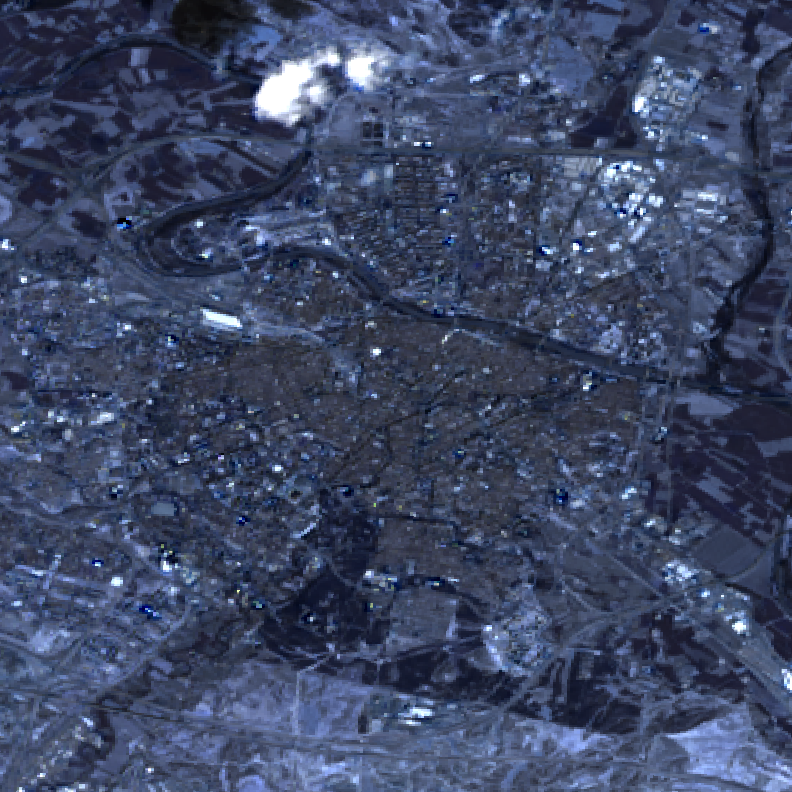

# Observer Geo API - Project
A simple NodeJS app to serve Satellite images.

## Api Documentation
Please check the [swagger.yaml](swagger.yaml) file. You can generate the client / test it using the public [Swagger Editor](https://editor.swagger.io/)

## Example Endpoint
You can test the live endpoint here:
https://observer-geo-api-tvymsgcb3q-nw.a.run.app/sat-images?place=zaragoza&date=2020-09-01
You should expect to see this image:



## How to install locally
```bash
npm install
```

#### Set ENV variables with API keys
```bash
export GMAPS_GEOCODE_API_KEY=<KEY>
export NASA_EARTH_API_KEY=<KEY>
```

#### Test / Run server locally
Run integration tests:
```bash
npm test
```

Start the local server:
```bash
npm start
```

## Run in Container
First build the image:
```bash
docker build -t whejna/observer-geo-api .
```

Then run the local container:
```bash
docker run -p 8080:8080 -e NASA_EARTH_API_KEY=<KEY> -e GMAPS_GEOCODE_API_KEY=<KEY> whejna/observer-geo-api
```

## Deploy as a GCP Cloud Run (Managed Service)
First build the image and upload it to Container Service:
```
gcloud builds submit --tag eu.gcr.io/observer-geo-api/observer-geo-api
```

Then, create a new managed service:
```bash
gcloud run deploy observer-geo-api --platform managed --image eu.gcr.io/observer-geo-api/observer-geo-api --set-env-vars GMAPS_GEOCODE_API_KEY=<KEY>,NASA_EARTH_API_KEY=<KEY> --region europe-west2 --allow-unauthenticated
```

